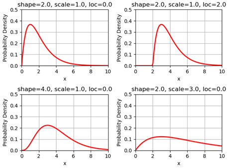
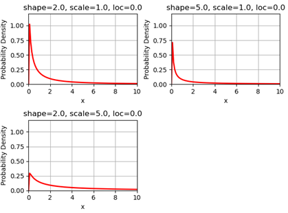

##############
Data Description
##############

**JUNE_NZ** requires a number of input files, all the files below can be created by :doc:`link <Data_creation>`

**********
1. Population data (demography)
**********

It defines the population (agents) to be used in the model.

.. tabularcolumns:: |p{5cm}|p{7cm}|p{4cm}|

.. csv-table:: Population/demography data
   :file: data/data_population.csv
   :header-rows: 1
   :class: longtable
   :widths: 1 1 1

.. note::

   ``The number of people (grouped by age)`` will determine the number of total people to be used in the model.

**********
2. Geography data
**********

It defines the geography (grid) to be used in the model.

.. tabularcolumns:: |p{5cm}|p{7cm}|p{4cm}|

.. csv-table:: Geography data
   :file: data/data_geography.csv
   :header-rows: 1
   :class: longtable
   :widths: 1 1 1

**********
3. Group (activities) data
**********

Group data contains different types of activities that an individual might do every day.

3.1 Company
===============
It defines the companies used in the model

.. tabularcolumns:: |p{5cm}|p{7cm}|p{4cm}|

.. csv-table:: Company data
   :file: data/data_company.csv
   :header-rows: 1
   :class: longtable
   :widths: 1 1 1

In the above data, ``Number of employers by firm size``, ``Number of employers by sector type`` and ``Number of employees``
are obtained from external dataset, while the ``company clousre`` and ``sub-sector configuration`` are defined in the variable ``FIXED_DATA``. For example,

.. code-block:: python

        "company": {
            "employees": {"employment_rate": 0.7},
            "company_closure": {
                "company_closure": {
                    "sectors": {
                        "A": {"key_worker": 1.0, "furlough": 0.0, "random": 0.0},
                        "P": {"key_worker": 0.0, "furlough": 0.0833, "random": 0.9167},
                        ...
                        "O": {"key_worker": 0.0, "furlough": 0.0, "random": 1.0},
                        "R": {"key_worker": 0.0, "furlough": 0.0, "random": 1.0},
                        "S": {"key_worker": 0.0, "furlough": 0.0, "random": 1.0},
                    }
                }
            },
            "subsector_cfg": {
                "age_range": [18, 64],
                "sub_sector_ratio": {"P": {"m": 0.4, "f": 0.6}, "Q": {"m": 0.5, "f": 0.5}},
                "sub_sector_distr": {
                    "P": {
                        "label": ["teacher_secondary", "teacher_primary"],
                        "m": [0.72526887, 0.27473113],
                        "f": [0.72526887, 0.27473113],
                    },
                    ...
                    "Q": {
                        "label": ["doctor", "nurse"],
                        "m": [0.65350126, 0.34649874],
                        "f": [0.16103136, 0.83896864],
                    },
                },
            },
        },

.. note::

        The ``Number of employees`` from NZStats somehome is smaller than the expected value compared to the NZ population. Therefore, in ``FIXED_DATA``
        we have a variable called ``employment_rate``, which is a factor makes the total ``number of employees`` matches to the assumed ``employment rate``.

3.2 Hospital
===============
It defines the hospital information used in the model

.. tabularcolumns:: |p{5cm}|p{7cm}|p{4cm}|

.. csv-table:: Hospital data
   :file: data/data_hospital.csv
   :header-rows: 1
   :class: longtable
   :widths: 1 1 1

The information would include the hospital address (latitude and longitude), number of beds and number of ICU beds.

3.1 Commute
===============

Commute defines how people move across different areas

.. tabularcolumns:: |p{5cm}|p{7cm}|p{4cm}|

.. csv-table:: Group/commute data
   :file: data/data_commute.csv
   :header-rows: 1
   :class: longtable
   :widths: 1 1 1

**********
4. Disease data
**********

Defines virus properties:

.. tabularcolumns:: |p{5cm}|p{7cm}|p{4cm}|

.. csv-table:: Disease/Disease data
   :file: data/data_disease.csv
   :header-rows: 1
   :class: longtable
   :widths: 1 1 1

4.1 Virus intensity
============

The virus intensity is a parameter that influences the severity of symptoms. 
As the intensity value increases, the likelihood of an individual experiencing more severe symptoms also increases. 
This can be achieved by elevating the probability of severe symptoms in addition to the 'infection_outcome' input data."

An example of the virus intensity is:

.. code-block:: python

        Covid19: 1.3 # 170852960
        B117: 1.5 # 37224668
        B16172: 1.5 # 76677444

4.1 Comorbidities
============

``Comorbidities`` are defined by the variable ``FIXED_DATA``, which is located in ``process/__init__.py``. The comorbidity is one of the parameters determing the severity of symptom that
an individual may experience.

- ``comorbidities_female``: the ratio of female have certain comorbidities (grouped by ages)
- ``comorbidities_male``: the ratio of male have certain comorbidities (grouped by ages)
- ``comorbidities_intensity``: the intensity of the comorbidities

.. note::

    For example, if the average female comorbidity intensity for the age group 50 is ``1.02``: tt is caculated by ``[0, 0.1, 0.9] * [0.8, 1.2, 1.0]`` where ``[0, 0.1, 0.9]`` is the 
    ratio of comorbidities and ``[0.8, 1.2, 1.0]`` represents the intensities of comorbidities. 
        
    If a person has disease2, which has the intensity of ``1.2``, then the symptom multiplier factor for this person is ``1.2/1.02=1.18`` which is larger than 1.0, 
    and therefore will lead to higher chance of experiencing severe symptoms.

An example of the defination of ``Comorbidities`` is:

.. code-block:: python

    FIXED_DATA = {
        ...

        "demography": {
            "comorbidities_female": {
                "comorbidity": ["disease1", "disease2", "no_condition"],
                5: [0, 0, 1.0],
                10: [0, 0, 1.0],
                20: [0, 0, 1.0],
                50: [0, 0.1, 0.9],
                75: [0, 0.2, 0.8],
                100: [0.9, 0.0, 0.1],
            },
            "comorbidities_male": {
                "comorbidity": ["disease1", "disease2", "no_condition"],
                5: [0, 0, 1.0],
                10: [0, 0, 1.0],
                20: [0, 0, 1.0],
                50: [0, 0.1, 0.9],
                75: [0, 0.2, 0.8],
                100: [0.9, 0.0, 0.1],
            },
            "comorbidities_intensity": {"disease1": 0.8, "disease2": 1.2, "no_condition": 1.0},
        }
        ...
    }

4.2 Transmission profile
============

4.2.1 Base probability of infection
----------------
The transmssion profile determins the probability of the infection (e.g, the higher the probabilities, the more infectiousness an infector can be). 

The probability of the infection is usually chosen from a ``Gamma`` profile, which is defined by ``(shape,shift,scale)``. 
The following figures show the ``Gamma`` profile for different ``shape``, ``shift (loc)`` and ``scale``. 
The x-axis is the value of ``shift (loc)``, which corresponds to the infection time. The y-axis is the probability of infection.

When a person is infected, the infection time will be applied to the above ``Gamma`` function (as ``x``), and then obtain the related probability of infection. 

4.2.1 Adjust max infectiousness
----------------

The maximum infectiousness from the probability of infection is adjusted with the argument ``max_infectiousness``. For an infector, a random
value will be drawn from the ``lognormal`` function, and it will be multiplied to the probability of function. 

The ``lognormal`` is determined by parameters of ``shape``, ``loc`` and ``scale``.
For example, the following figures show the ``lognormal`` profile:

4.2.2 Adjust mild/asymptomatic infectiousness
----------------

We can adjust the the probability of infection based on a person's maximum symptom. For example, if the maximum symtom is ``asymptomatic``, we can
reduce the probability of infection profile by 50%.

An example for ``COVID-19`` transmission is set up as:

.. code-block:: python

        type:
                'gamma'
        shape:
                type: normal 
                loc: 1.56
                scale: 0.08
        rate:
                type: normal 
                loc: 0.53
                scale: 0.03
        shift:
                type: normal 
                loc: -2.12
                scale: 0.1
        asymptomatic_infectious_factor:
                type: constant
                value: 0.5
        mild_infectious_factor:
                type: constant
                value: 1.
        max_infectiousness:
                type: lognormal
                s: 0.5 
                loc: 0.0
                scale: 1. 

4.3 Symptom trajectory
============

For the symptom trajectory, it is defined by a set of distribution functions (e.g., beta, log-normal etc.). 
Each distribution function comes with a set of parameters, those parameters decide the timeline for different symptoms during the infection.

The considered symptom stages include:

- Recovered (-3)
- Healthy (-2)
- Exposed (-1)
- Asymptomatic (0)
- Mild (1)
- Severe (2), which is calculated by ``1.0 - [ Hospital + Die (from Home) + Asymptomatic + Mild]``
- Hospital (3)
- ICU (4)
- Die (from home, 5)
- Die (from hospital, 6)
- Die (from ICU, 7)

For example, if we need to create a symptom trajectory for ``Die (from hospital, 6)``, 
we need to go through the stages of ``Exposed (-1)``, ``Mild (1)``, ``Hospital (3)`` and ``Die (from hospital, 6)`` one by one. 
Among this trajectory, at the stage of ``mild (-1)``, we create samples from a ``log-normal`` distribution with a specific, predefined parameters 
(e.g., ``shape=0.55``, ``loc=0.0``, ``scale=5.0``), a random number is drawn from these samples, 
and it represents the timing for the infection (or we can understand it as the end time for the stage of symptom).

The chance of having a symptom is determined by:

- Comorbidities (see the section of comorbidities for details)
- Input infection outcome statistics (e.g., the percentage of symptoms that a person may experience)
- The target virus intnsity

An example of the symptom trajectory is:

.. code-block:: python

        # exposed => mild => hospitalised => dead
        - stages:
        - symptom_tag: exposed
                completion_time:
                type: beta
                a: 2.29
                b: 19.05
                loc: 0.39
                scale: 39.8

        - symptom_tag: mild
                completion_time:
                type: lognormal
                s: 0.55
                loc: 0.0
                scale: 5.

        - symptom_tag: hospitalised
                completion_time:
                type: beta
                a: 1.21
                b: 1.97
                loc: 0.08
                scale: 12.9      

        - symptom_tag: dead_hospital
                completion_time:
                type: constant
                value: 0.

An example of the infection outcome statistics is:

.. tabularcolumns:: |p{5cm}|p{7cm}|p{7cm}|p{7cm}|

.. csv-table:: Disease/ infection outcome 
   :file: data/infection_outcome_ratio.csv
   :header-rows: 1
   :class: longtable
   :widths: 1 1 1 1