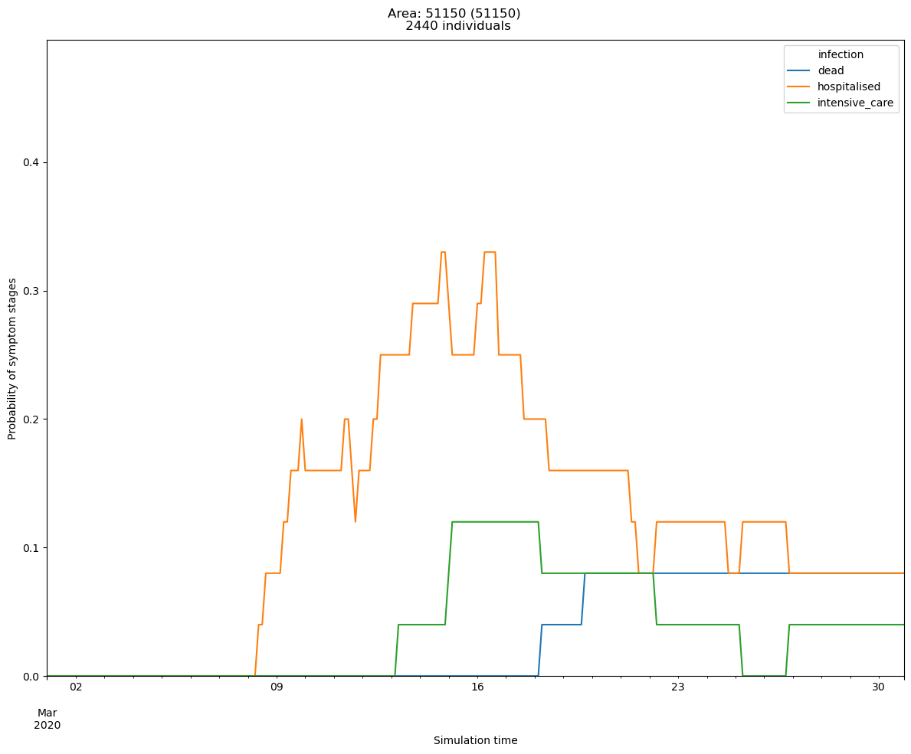
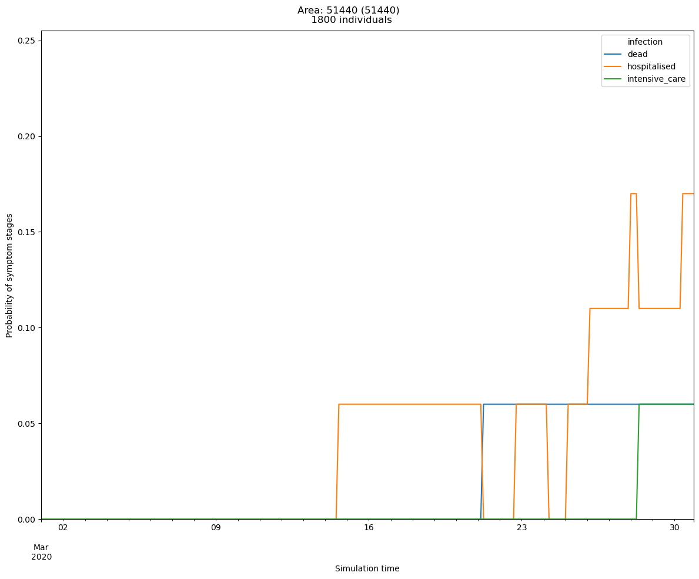

Model tuning
=====

This page gives several examples about how to tune the model output towards observation.

The base example is given using the COVID-19 configuration of **JUNE**, the following parameters may be tuned:

- The number of people travel across super areas (e.g., ``group/commute/workplace_and_home.csv``).
- Infection outcome (e.g., ``disease/infection_outcome.csv``)

The experiments used to demostrate the tuning of model are described below:

.. tabularcolumns:: |p{5cm}|p{7cm}|p{4cm}|

.. csv-table:: Tuning information
   :file: data/tuning_exp.csv
   :header-rows: 1
   :class: longtable
   :widths: 1 1 1

**********
Base example
**********
The base example is used to show the model outputs without any tuning. 
The following figures are the model outputs for the Area of 51150 and 51440, showing the percentages of population who died, were hospitalized, and placed into ICU.

|pic1| any text |pic2|

   Figure 1: Infection for 51150

   Figure 2: Infection for 51440

